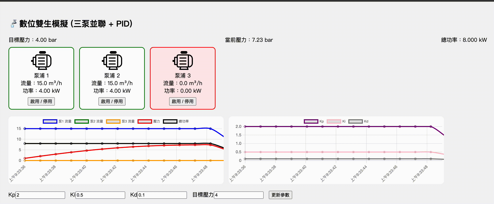

# PID Pump Control Simulator

這是一個基於 Flask 的模擬系統，用於展示如何透過 PID 控制器來調節三台水泵以達成目標壓力。提供即時數據更新、參數調整與水泵開關功能，適合教學與測試用途。

## 🔧 功能介紹

- 使用 PID 控制器來調節壓力
- 三台水泵模擬流量與功率輸出
- 可即時透過 API 取得系統狀態
- 可動態調整 PID 參數與目標壓力
- 提供簡易網頁前端介面 (index.html)
- 系統狀態具有簡單歷史紀錄功能（最多 40 筆）

## 🖼 系統架構
Flask (Python)
│
├── / (index.html - 前端頁面)  
├── /api/data 取得即時模擬數據  
├── /api/update_params 更新 PID 控制參數  
└── /api/toggle/<id> 切換指定水泵開關狀態  
---

## 🧪 API 說明

### `GET /api/data`
取得當前模擬狀態資料。

Response 範例：
json
{
  "pump_states": [1, 1, 0],
  "flows": [15.0, 15.0, 0.0],
  "powers": [4.0, 4.0, 0.0],
  "total_pressure": 3.85,
  "total_power": 8.0,
  "params": {
    "Kp": 2.0,
    "Ki": 0.5,
    "Kd": 0.1,
    "target_pressure": 4.0
  },
  "history": {...}
}
POST /api/update_params
更新 PID 控制器參數與目標壓力。

Request JSON 範例：

{
  "Kp": 1.5,
  "Ki": 0.3,
  "Kd": 0.05,
  "target_pressure": 5.0
}
POST /api/toggle/<pump_id>
切換指定水泵開關狀態。pump_id 為 0、1 或 2。

▶️ 執行方式
安裝必要套件（建議使用虛擬環境）：

pip install flask
啟動應用：
python app.py

開啟瀏覽器前往：
http://localhost:5000

📁 專案結構
bash
複製
編輯
app.py              # 主程式
templates/
└── index.html      # 前端視覺化頁面（自行擴充）
💡 延伸功能建議
將前端改為使用 Chart.js 即時顯示壓力與功率變化

增加持久化儲存（例如 SQLite 或 JSON）

增加登入機制保護控制端 API

📜 授權
MIT License

demo:

